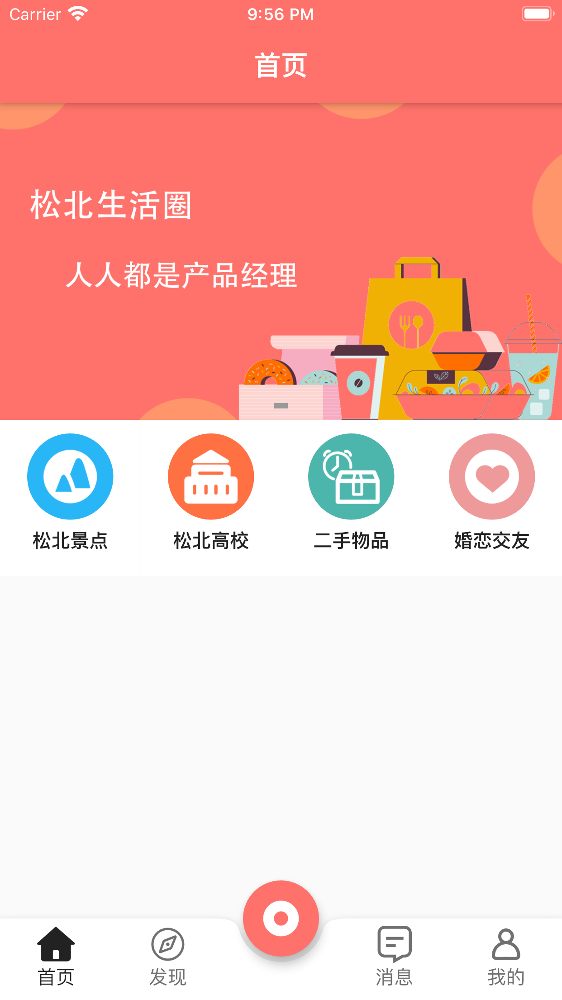

# flutter_songbei

松北生活圈

lib/app_config.dart


```
class AppConfig {
  static const APP_NAME = '松北生活圈';
  static const UMENG_ANDROID_KEY = '';
  static const UMENG_IOS_KEY = '';
  static const ANDROID_CHANNEL_FIR_IM = 'fir_im';
  static const ANDROID_CHANNEL_GOOGLE_PLAY = 'google_play';
//  static final ANDROID_CHANNEL = ANDROID_CHANNEL_FIR_IM;
  static const ANDROID_CHANNEL = ANDROID_CHANNEL_GOOGLE_PLAY;
  static const FIT_IM_ID = '';
  static const FIT_IM_API_TOKEN = '';
  static final IOS_APP_ID = '';//app store id


  static final BANNER_SCALE = 720/1280;
}
```

##App截图


